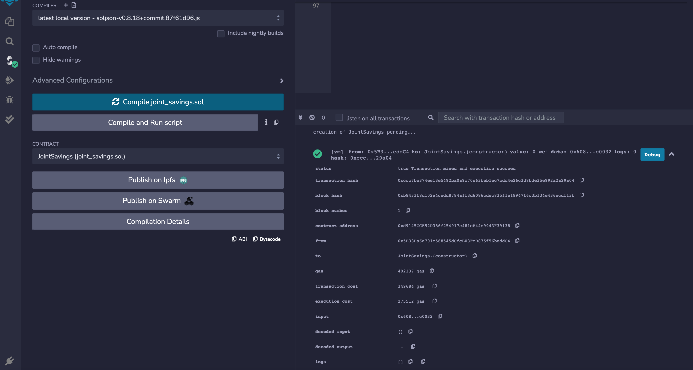
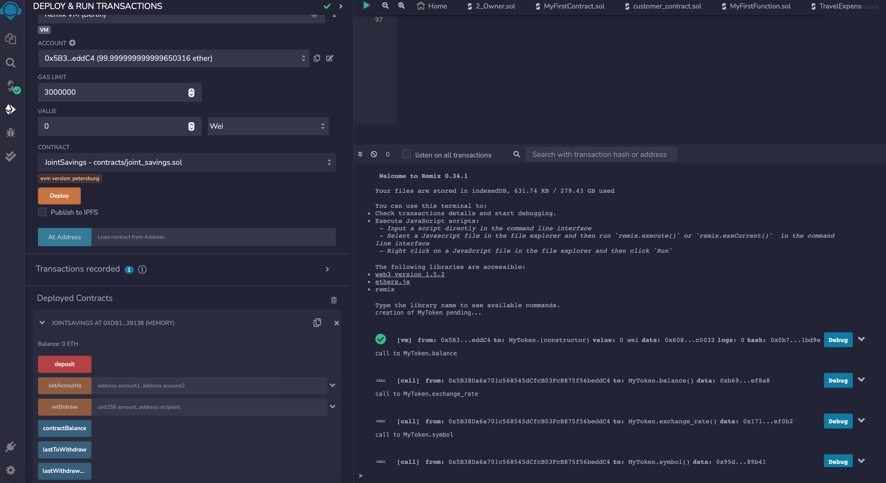
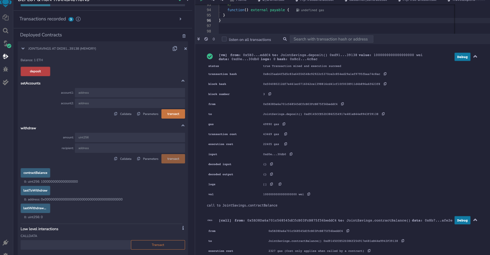
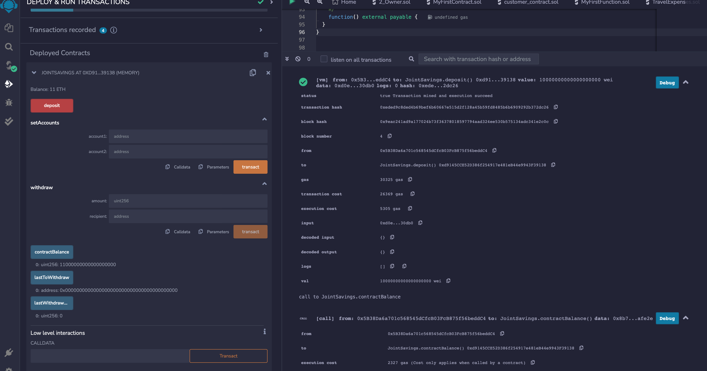
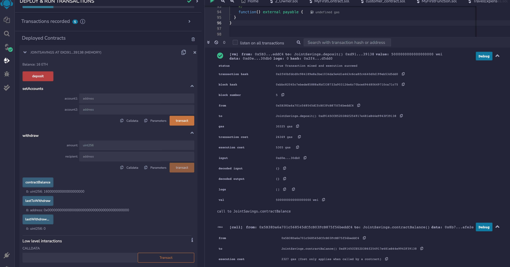
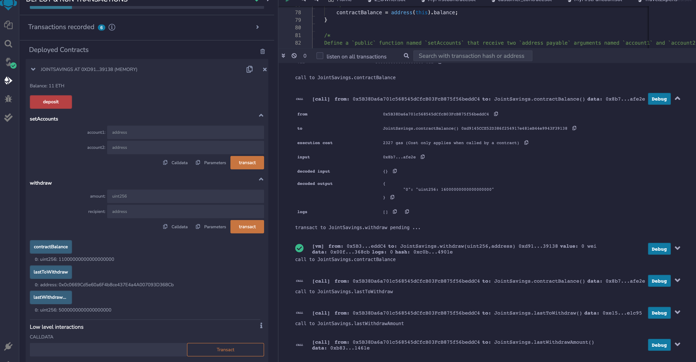
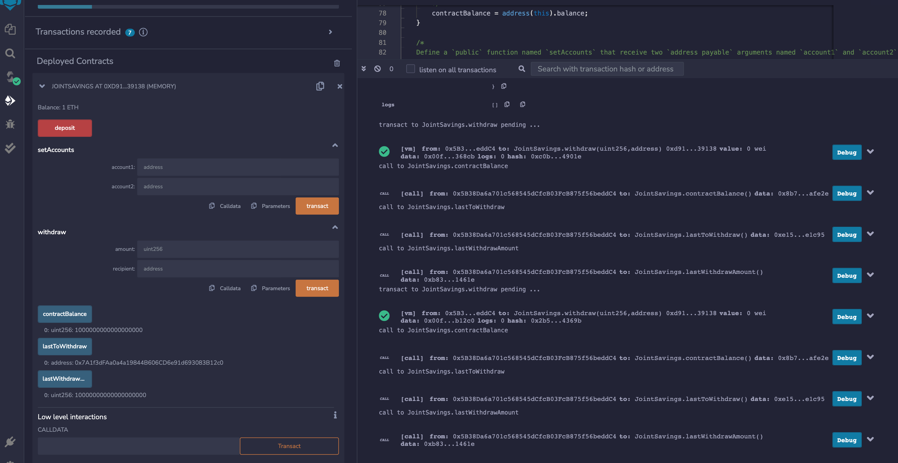

# Joint Savings Account

## Savings Account Contract in Solidity

* Below are action screens showing the Joint Account performs as expected with deposits and withdrawals.

* Compiled Contract

* Deployed Contract

* Deposit 1 Ether

* Deposit 10 Ether

* Deposit 5 Ether

* Withdraw 5 Ether into AccountOne

* Withdraw 10 Ether into AccountTwo

